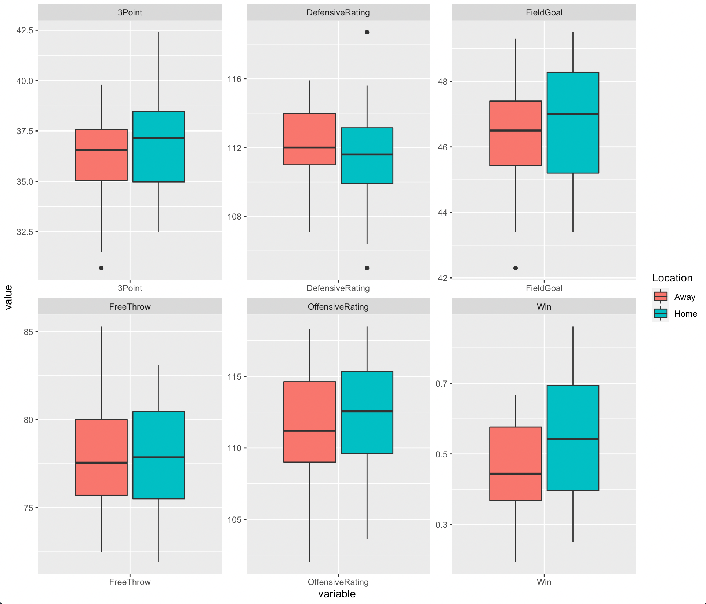

# NBA-Data

Big Question: With this project, I wanted to find out if a home court advantage in basketball actually exists and if so, what stats such as FT and 3P percentages are most effected. In my analysis, I also looked over offensive and defensive ratings to find out which is better for winning.

Data Process: My data for this project comes from the NBA website and was collect by manual data entry into Excel as there was no option to save the data as a csv file. The [NBA Stats](https://www.nba.com/stats/) database is very comprehensive but I only needed the win percentage (win%), free throw percentage (FT%), field goal percentage (FG%), 3 point percentage (3P%), and offensive and defensive ratings for both home and away games. With only 30 teams and one season, manual input was manageable. However, if I wanted to extend my analysis over multiple seasons and additional statistics, I would need to incorporate data mining or find another data source. The Win, Offensive, and Defensive columns were created in Excel by taking the average of the home and the away values. I needed the total average in order to find out the correlation between win% and offensive vs defensive rating.

Upon importing the dataset into R, I realized that it needed to be in a different format to create the boxplots. I started off by melting the data in long format so every row is a single observation using the library package "reshape2". After this, I created a new column called "Location" to add either "Away" or "Home". I started by making all the values "Away" then using a loop to change the rows with a home value such as "HomeFT" or "Home3P" to "Home". Now that I had the location column created, I needed the variables to lose their location identifier. Because the loop did not work in changing these values, I had to export it into Excel and manually change the names. After that, the dataset was imported into R and a boxplot was created using ggplot2 and the facet wrap feature. 

Data Sources:

[Home Traditional Stats](https://www.nba.com/stats/teams/traditional/?sort=W_PCT&dir=-1&Season=2020-21&SeasonType=Regular%20Season&Location=Home)

[Away Traditional Stats](https://www.nba.com/stats/teams/traditional/?sort=W_PCT&dir=-1&Season=2020-21&SeasonType=Regular%20Season&Location=Road)

[Home Ratings](https://www.nba.com/stats/teams/advanced/?sort=W&dir=-1&Season=2020-21&SeasonType=Regular%20Season&Location=Home)

[Away Ratings](https://www.nba.com/stats/teams/advanced/?sort=W&dir=-1&Season=2020-21&SeasonType=Regular%20Season&Location=Road)

This table shows the difference between the average home game value and the average away game value. On average, the teams performed better in all categories at home. Although relatively small, there does seem to be a home team advantage, at least for the 2020 - 2021 NBA season. The biggest takeaway would be the three point percentage which was 0.7% better at home games, which makes it the most affected by the home team advantage. Another interesting finding was how small the free throw percentage was. In away games, there is a lot more pressure from the other team's fans, however, this doesn't seem to be that much of a problem of players. This brings up the question of the effect fans have on the home team advantage.  

| Win    	| FreeThrow 	| FieldGoal 	| ThreePoint 	|
|--------	|-----------	|-----------	|------------	|
| 0.087% 	| 0.093%    	| 0.39%     	| 0.707%     	|  

Using a simple correlation test, I found that the offensive rating had a 0.832 correlation coefficient and the defensive rating had a -0.377 correlation coefficient with the win% column. I created a column of the offesive skew, that is, how much greater is the teams offesive rating than their defensive rating. When plotted, I found that the teams with a greater offensive rating won more than teams with an even split of offense and defense.

